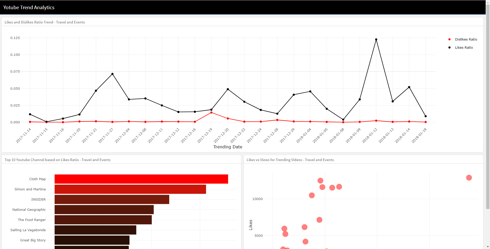
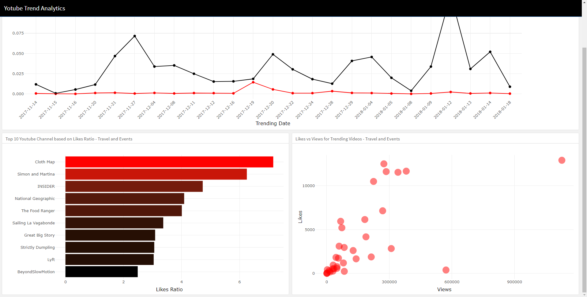

# Interactive Plotting Quiz

This quiz is part of Algoritma Academy assessment process. Congratulations on completing the Interactive Plotting course! We will conduct an assessment quiz to test your ability in making interactive plot and dashboard that you have learned on the course. The quiz is expected to be taken in the classroom, please contact our team of instructors if you missed the chance to take it in class.

## Inspecting Dataset
 
We will be using a dataset of trending videos in YouTube stored within the `datainput` folder under the `youtube.csv` file. The data consists of all trending videos in the United States from November 2017 to January 2018 with a total of 2986 observations and 9 variables. Please use the following glossary for reference:

 * `trending_date`: Video trending date
 * `title`: Video title
 * `channel_title`: Name of the YouTube channel
 * `category_id`: Video category
 * `publish_time`: Date when the video was published
 * `views`: Number of video views
 * `likes`: Number of video likes
 * `dislikes`: Number of video dislikes
 * `comment_count`: Number of video comments

Read the dataset and save it into an object named `youtube`:

```{r}
# Your code here
```

Say, you are working as a marketing analyst for a YouTube channel. You are trying to give your clients recommendations on prospective YouTube channels that they can collaborate with for an advertisement. Since the client is a travel agent, only top ranking YouTube channels within the *Travel and Events* category will be considered. The metrics you are using to rate each channel are the ratio between *likes* and *views* (*likes_ratio*).

Take the top 10 YouTube channels based on the highest *likes_ratio* by completing the code below:

```{r}
library(dplyr)

youtube %>% 
  ___(category_id == "Travel and Events") %>%
  group_by(channel_title) %>% 
  ___(likes_ratio = mean(likes/views)) %>% 
  ___() %>% 
  ___(desc(likes_ratio)) %>% 
  head(10)
```
___

1. Which `dplyr` functions is appropriate to fill in the code above?
  - [ ] select, summarise, ungroup, arrange
  - [ ] select, mutate, arrange, ungroup
  - [ ] filter, summarise, ungroup, arrange
  - [ ] filter, mutate, arrange, ungroup 
___


## Building Dashboard Application

Based on the YouTube channels you have extracted, you are planning to create a dashboard prototype for your client using a flexdashboard. You created a mockup with the following design:




___
2. To produce the layout using flexdashboard templates, how should the layout be structured?
  - [ ] orientation: rows ; 2 headers in the first section, 1 header in the second section ; vertical_layout: fill
  - [ ] orientation: rows ; 1 header in the first section, 2 headers in the second section ; vertical_layout: scroll
  - [ ] orientation: columns ; 2 headers in the first section, 1 header in the second section ; vertical_layout: fill
  - [ ] orientation: columns ; 1 header in the first section, 2 headers in the second section ; vertical_layout: scroll
___


Now pay attention to the bottom-left plot. The plot shows top 10 Youtube channel with highest likes ratio within the Travel and Events category. Say you would like to add a shiny interactivity feature where users could pick their desired category and the plot would change accordingly.
___
3. Which one from the input type below is appropriate for the given type of selection?
  - [ ] dateInput()
  - [ ] numericInput()
  - [ ] sliderInput()
  - [ ] selectInput()
___


Now pay attention to the top plot. You want to have a more interactive plot with shows information about the likes ratio and dislikes ratio on each date. Since you realized that adding text/label could be overcrowded for the plot. You are planning to render a *plotly* object that shows both information just when each hover action.
___
4. Which of the following code is correctly paired between render function and output in order to create the plotly object on Shiny Dashboard?
  - [ ] plotlyOutput("plot1") ; output$plot1 <- renderPlotly({}) 
  - [ ] plotlyOutput("plot1") ; output$plot1 <- renderPlot({}) 
  - [ ] plotOutput("plotly1") ; output$plotly1 <- renderPlotly({}) 
  - [ ] plotOutput("plot1") ; output$plot1 <- renderPlot({})
 ___
