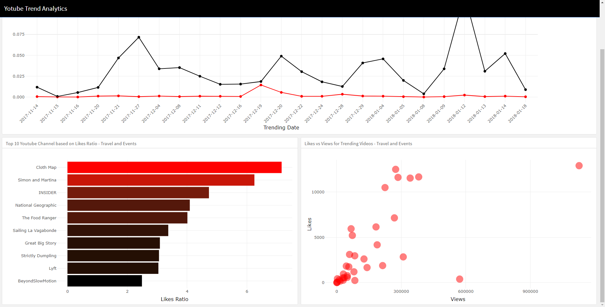

```{r setup, include=FALSE}
knitr::opts_chunk$set(echo = TRUE)
```

# Kuis Interactive Plotting

Kuis ini merupakan bagian dari proses penilaian *Algoritma Academy*. Selamat anda sudah menyelesaikan materi *Interactive Plotting and Web Dashboard*! Kami akan melakukan penilaian berupa kuis untuk menguji materi yang sudah dipelajari. Pengerjaan Kuis diharapkan dapat dilakukan di dalam kelas, silakan hubungi tim instruktur kami jika Anda melewatkan kesempatan untuk mengambilnya di kelas.

## Memeriksa Data set

Kita akan menggunakan dataset video trending di YouTube yang disimpan dalam folder `datainput`dengan nama file `youtube.csv`. Data tersebut terdiri dari seluruh video trending di Amerika Serikat dari November 2017 hingga Januari 2018 dengan total 2986 observasi dan 9 variabel. Silakan gunakan glosarium berikut sebagai referensi:

 * `trending_date`: Tanggal video trending
 * `title`: Judul video
 * `channel_title`: Nama saluran (*channel*) YouTube
 * `category_id`: Kategori video
 * `publish_time`: Tanggal video dipublikasikan
 * `views`: Jumlah penonton pada video
 * `likes`: Jumlah penonton yang menyukai video
 * `dislikes`: Jumlah penonton yang tidak menyukai video
 * `comment_count`: Jumlah komentar pada video

*Import* dataset tersebut dan simpan kedalam objek dengan nama `youtube`:

```{r}
# baca dan periksa data disini
youtube <- read.csv("datainput/youtube.csv")
head(youtube, 3)
```

Anda bekerja sebagai *marketing analyst* untuk saluran/channel YouTube. Anda mencoba memberikan rekomendasi channel YouTube yang baik untuk dipasangkan iklan sesuai kebutuhan klien. Karena klien tersebut bekerja sebagai agen perjalanan (*travel agent*), maka hanya channel YouTube dengan peringkat teratas dari kategori *Travel and Events* yang akan dipertimbangkan. Ukuran yang Anda gunakan untuk menilai setiap channel adalah rasio antara *likes* dan *views* (*likes_ratio*) dari channel tersebut.

Ambil 10 channel YouTube dengan peringkat teratas berdasarkan *likes_ratio* tertinggi dengan melengkapi kode di bawah ini:

```{r}
library(dplyr)

# youtube %>% 
#   ___(category_id == "Travel and Events") %>%
#   group_by(channel_title) %>% 
#   ___(likes_ratio = mean(likes/views)) %>% 
#   ___() %>% 
#   ___(desc(likes_ratio)) %>% 
#   head(10)
```
___

1. Fungsi `dplyr` mana yang sesuai untuk mengisi kode di atas?  
  - [ ] select, summarise, ungroup, arrange
  - [ ] select, mutate, arrange, ungroup
  - [ ] filter, summarise, ungroup, arrange
  - [ ] filter, mutate, arrange, ungroup 
___


## Membangun Aplikasi Dashboard

Berdasarkan channel YouTube yang telah Anda ekstrak, Anda berencana untuk membuat prototipe *dashboard* untuk klien Anda menggunakan flexdashboard. Anda membuat *mockup* dengan desain berikut:



___

2. Untuk menghasilkan tata letak (*layout*) seperti di atas menggunakan *template* dari flexdashboard, bagaimana seharusnya tata letak disusun?
  - [ ] orientation: rows ; 2 header pada bagian pertama, 1 header pada bagian kedua dan vertical_layout: fill
  - [ ] orientation: rows ; 1 header pada bagian pertama, 2 header pada bagian kedua dan vertical_layout: scroll
  - [ ] orientation: columns ; 2 header pada bagian pertama, 1 header pada bagian kedua dan vertical_layout: fill
  - [ ] orientation: columns ; 1 header pada bagian pertama, 2 header pada bagian kedua dan vertical_layout: scroll
  
*Referensi Opsi Bahasa Inggris:*
  
  - [ ] orientation: rows ; 2 headers in the first section, 1 header in the second section ; vertical_layout: fill
  - [ ] orientation: rows ; 1 header in the first section, 2 headers in the second section ; vertical_layout: scroll
  - [ ] orientation: columns ; 2 headers in the first section, 1 header in the second section ; vertical_layout: fill
  - [ ] orientation: columns ; 1 header in the first section, 2 headers in the second section ; vertical_layout: scroll  
___


Sekarang perhatikan plot yang terdapat pada bagian kiri bawah. Plot tersebut menunjukkan 10 channel Youtube dengan *likes_ratio* tertinggi dari untuk kategori *Travel and Events*. Bila Anda ingin menambahkan fitur interaktif yang menarik dimana pengguna dapat memilih kategori yang mereka inginkan dan plot akan berubah sesuai dengan kategori tersebut.
___
3. Manakah dari jenis masukan (*input type*) di bawah ini yang sesuai untuk jenis pilihan di atas?
  - [ ] dateInput()
  - [ ] numericInput()
  - [ ] sliderInput()
  - [ ] selectInput()
___
  

Sekarang perhatikan plot yang terdapat pada bagian atas, Anda ingin memiliki plot yang lebih informatif dengan menampilkan informasi [*likes ratio*] dan [*dislikes ratio*] pada setiap tanggal. Namun, Anda menyadari bahwa menambahkan text/label dapat membuat tampilan plot menjadi sangat penuh (tidak rapi). Anda berencana untuk membuat object *plotly* yang dapat menampilkan kedua informasi tersebut hanya jika kursor diarahkan ke bagian tertentu pada plot.
___
4. Manakah dari kode berikut yang merupakan pasangan yang tepat antara jenis keluaran (*output type*) dan fungsi render untuk membuat plotly pada Shiny Dashboard?
  - [ ] plotlyOutput("plot1") ; output$plot1 <- renderPlotly({}) 
  - [ ] plotlyOutput("plot1") ; output$plot1 <- renderPlot({}) 
  - [ ] plotOutput("plotly1") ; output$plotly1 <- renderPlotly({}) 
  - [ ] plotOutput("plot1") ; output$plot1 <- renderPlot({})
 ___